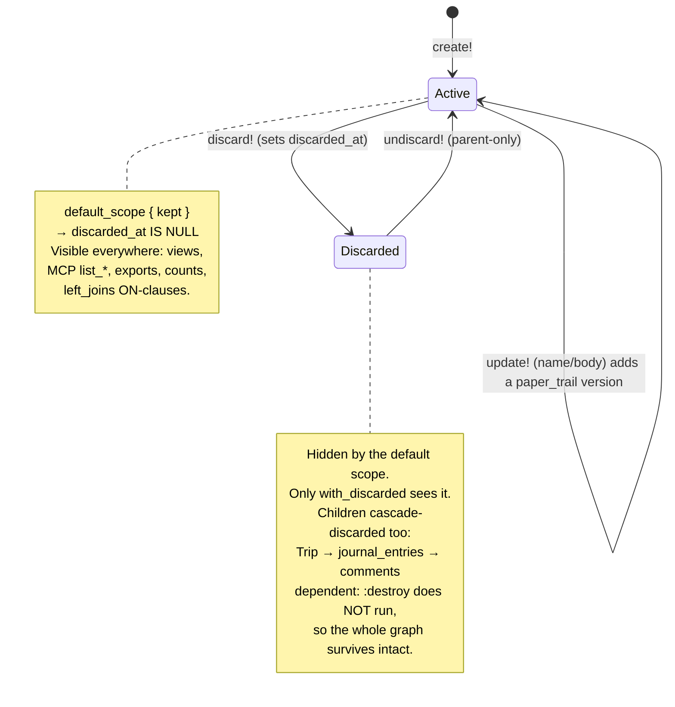
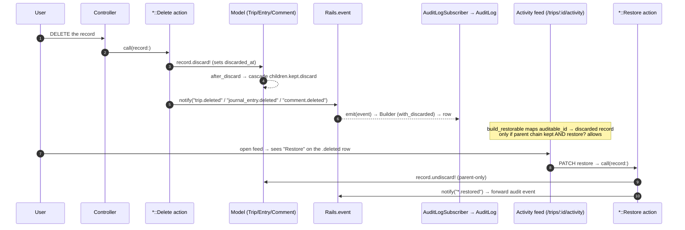
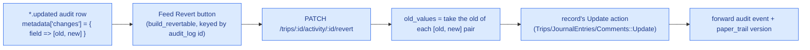

# Persistence safety (Phase 25)

Three complementary systems protect the critical, user-authored models —
`Trip`, `JournalEntry`, `Comment` — from accidental or malicious data loss.
Each answers a different question:

| System | Gem | The question it answers |
|--------|-----|-------------------------|
| **Soft delete** | `discard` | "It's gone — get it back." A deleted record is hidden, not destroyed, and can be restored with its whole child graph. |
| **Versioning** | `paper_trail` | "What did this say before — undo the edit." Every title/body edit is a revertible snapshot. |
| **AuditLog feed** | (Phase 21) | "Who did what — and the feed that surfaces Restore/Revert." The trip Activity feed renders the actions and the buttons to reverse them. |

> All diagrams below are [Mermaid](https://mermaid.js.org/) — they render inline
> on GitHub and can be pasted into <https://excalidraw.com> via
> **Insert → Mermaid to Excalidraw** for free-form editing.

---

## 1. Record lifecycle

A record is **Active** (kept) by default. `discard!` moves it to **Discarded**
(sets `discarded_at`, hidden by `default_scope { kept }`); `undiscard!` brings it
back. Editing a journal entry's title or body adds a `paper_trail` version
without changing the lifecycle state.



**Why the graph survives.** `discard` does not run validations and does not
trigger `dependent: :destroy`. A discarded trip keeps its memberships,
reactions, and attachments — that is precisely what lets a parent-only restore
recover everything beneath it.

**Cascade is down-only.** `Trip` has
`after_discard { journal_entries.kept.find_each(&:discard) }` and `JournalEntry`
has `after_discard { comments.kept.find_each(&:discard) }`. There is **no**
`after_undiscard` counterpart — restore is parent-only by design, so restoring a
trip does not auto-resurrect entries that were independently deleted first.

---

## 2. Delete → feed → restore

Deleting routes through the `*::Delete` action, which discards (cascading down)
and emits a `*.deleted` event. `AuditLogSubscriber` records it; the Activity feed
then offers a **Restore** button on that row, which calls the `*::Restore` action.



### Revert (an edit, not a delete)

Each `*.updated` audit row carries its diff `{ field => [old, new] }` in
`metadata["changes"]`. The feed's **Revert** button re-applies the *old* values
through the record's normal Update action — so the revert is itself a forward
audit + version event, never a history edit.



**Coverage.** Revert handles column fields — trip title/description/location/
dates and comment body. The journal-entry **rich-text body is not a column**, so
it never appears in the feed diff and is intentionally out of scope for Revert
(its history lives in `paper_trail` on `ActionText::RichText` instead).

### Where users reach these

- **Restore a deleted trip:** the trips index trash view — `/trips?discarded=1`
  ("Recently deleted"), superadmin-only, with a per-trip Restore button.
- **Restore a deleted entry/comment, or revert an edit:** the trip **Activity
  feed** (`/trips/:id/activity`) — a Restore button on `*.deleted` rows and a
  Revert button on `*.updated` rows, each shown only to users the policy allows.

Every button is authorised server-side (`restore?` / `update?`), not merely
hidden in the view.

---

## 3. Gotchas / rules

- **Delete now means discard.** No real `destroy` fires for `Trip`,
  `JournalEntry`, or `Comment`. `dependent: :destroy` only runs on an actual hard
  destroy, which the app no longer triggers for these models.
- **Use `with_discarded` everywhere you must see deleted rows** — restore paths,
  admin/trash views, and `AuditLog::Builder` subject finders. The default `kept`
  scope hides discarded rows from every other read path (this is the safety
  guarantee, not a bug).
- **`with_discarded.discarded`, never bare `.discarded`.** A bare `.discarded`
  self-contradicts `default_scope { kept }` (`discarded_at IS NULL AND IS NOT
  NULL` → always empty).
- **`paper_trail` requires the JSON serializer for `reify`.** Psych 4
  `safe_load` rejects `ActiveSupport::TimeWithZone`
  (`Psych::DisallowedClass`); JSON snapshots type-cast back cleanly.
- **The journal-entry body is versioned on `ActionText::RichText`, not on
  `journal_entries` columns.** Body edits therefore do not appear as
  Activity-feed column diffs.
- **`discard` skips validations and `dependent: :destroy`.** A discarded trip
  keeps its memberships, reactions, and attachments intact — that is what makes
  restore recover the whole graph.
- **Cascade is down-only.** Discarding a parent discards its kept children;
  restoring a parent does **not** re-discard or re-restore children. Restore is
  parent-only by design.

---

## 3b. Media soft-delete + restore (Phase 26)

Phase 26 extends the same Delete → feed → Restore loop to **per-item media** —
one image or one video removed from an entry — with two retention mechanisms,
because the two kinds differ in shape.

| Media | Mechanism | Why |
|-------|-----------|-----|
| **Video** | Discard the `JournalEntryVideo` row (`Discard::Model` + `default_scope { kept }`) | It is already a model. The row survives discard, so its `source`/`web`/`poster` attachments stay and the blobs are never orphaned. Identical to Phase 25. |
| **Image** | Detach the `ActiveStorage::Attachment` **without purge** into a `DetachedAttachment` retention record | Active Storage has no soft-delete and images have no per-item model. The record holds the blob + denormalised metadata and *is* the "removed" state; it doubles as the feed auditable. |

Two rules carry the whole design:

1. **`attachment.delete`, never `attachment.destroy`.** `has_many_attached` defaults
   to `dependent: :purge_later`, so `destroy` fires an `after_destroy_commit` that
   **purges the blob** — deleting the stored file the instant the job runs (i.e. in
   production). `delete` skips callbacks, keeping the blob for restore.
2. **`OrphanBlobsCleanupJob` excludes retained blobs.** A detached image blob has
   zero attachments, so the 24h orphan sweep would purge it. The job excludes
   `DetachedAttachment.select(:blob_id)`. This is the single load-bearing
   data-safety line; its spec is a merge gate.

Per-item restore re-attaches the retained blob (image) or `undiscard!`s the row
(video), surfaced as a **Restore** button on the `*.removed` feed row. Image
events use the `detached_attachment` entity so the feed auditable is the per-item
record, not the entry.

**Entry restore cascade-restores its videos** (issue #206). The entry cascade
discards videos with a raw `discard` (no event), so a parent-only entry restore
would strand them with no feed button. `JournalEntries::Restore` captures the
entry's `discarded_at` before `undiscard!` and re-restores the videos with
`discarded_at >= cutoff` (the cascade cohort) — videos removed individually
*earlier* keep a smaller timestamp and stay removed. Comments remain parent-only.

## 4. Where it lives

```
Models (include Discard::Model, default_scope { kept }, cascade after_discard)
  app/models/trip.rb                # + after_discard → journal_entries
  app/models/journal_entry.rb       # + after_discard → comments; has_paper_trail only: [:name]
  app/models/comment.rb

Actions
  app/actions/trips/delete.rb              # discard!
  app/actions/trips/restore.rb             # undiscard! + trip.restored
  app/actions/journal_entries/delete.rb    # discard!
  app/actions/journal_entries/restore.rb   # undiscard! + journal_entry.restored
  app/actions/comments/delete.rb           # discard!
  app/actions/comments/restore.rb          # undiscard! + comment.restored
  app/actions/journal_entries/create.rb    # PaperTrail.request(whodunnit:)
  app/actions/journal_entries/update.rb    # PaperTrail.request(whodunnit:)

Media soft-delete (Phase 26)
  app/models/journal_entry_video.rb        # Discard::Model + default_scope { kept }
  app/models/detached_attachment.rb        # image retention record + feed auditable
  app/actions/journal_entry_videos/{delete,restore}.rb  # discard!/undiscard! + events
  app/actions/journal_entries/remove_image.rb           # attachment.delete (no purge)
  app/actions/journal_entries/restore_image.rb          # re-attach + destroy record
  app/jobs/orphan_blobs_cleanup_job.rb     # excludes DetachedAttachment blobs (load-bearing)
  app/policies/journal_entry_video_policy.rb            # destroy?/restore?
  app/controllers/journal_entry_{videos,images}_controller.rb

Initializers
  config/initializers/paper_trail.rb              # JSON serializer (Psych 4 reify)
  config/initializers/paper_trail_action_text.rb  # versions the rich-text body

Migrations
  db/migrate/20260530100000_add_discarded_at_to_critical_models.rb  # discarded_at + index
  db/migrate/20260530153128_create_versions.rb                      # UUID-corrected versions table
  db/migrate/20260530153129_add_object_changes_to_versions.rb       # object_changes diff column

Feed integration (Phase 21 AuditLog)
  app/models/audit_log/builder.rb           # subject finders use with_discarded
  app/controllers/audit_logs_controller.rb  # build_restorable / build_revertable / #revert
  app/controllers/trips_controller.rb       # ?discarded=1 trash view + #restore
  app/components/audit_log_card.rb          # Restore + Revert buttons

Policies (restore? mirrors destroy?)
  app/policies/trip_policy.rb
  app/policies/journal_entry_policy.rb
  app/policies/comment_policy.rb

Routes (config/routes.rb)
  PATCH /trips/:id/restore
  PATCH /trips/:trip_id/journal_entries/:id/restore
  PATCH /trips/:trip_id/journal_entries/:journal_entry_id/comments/:id/restore
  PATCH /trips/:trip_id/activity/:id/revert
```

---

See the [Audit Journal (Phase 21)](../AGENTS.md) section in the root `AGENTS.md`
for the underlying event-capture pipeline this feature builds on.
