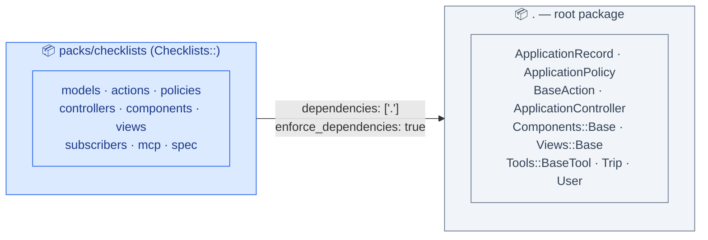
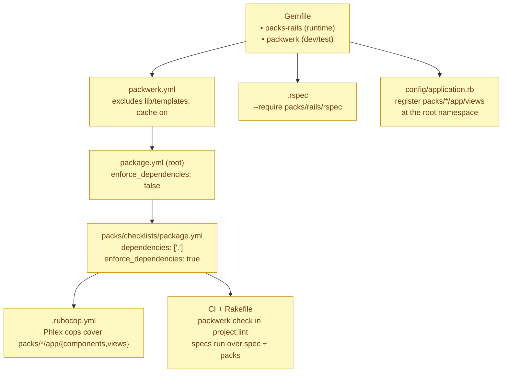
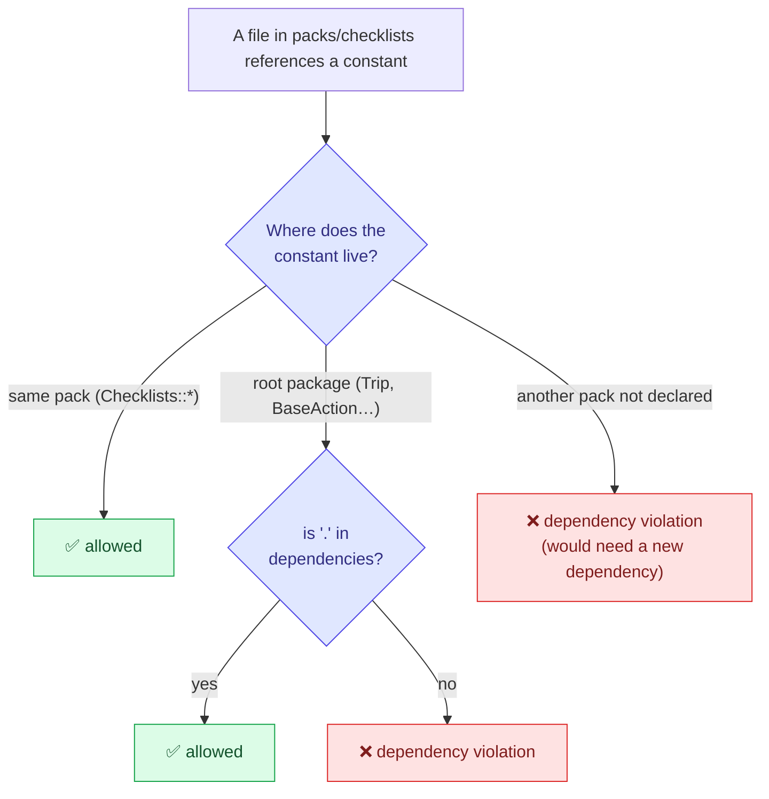
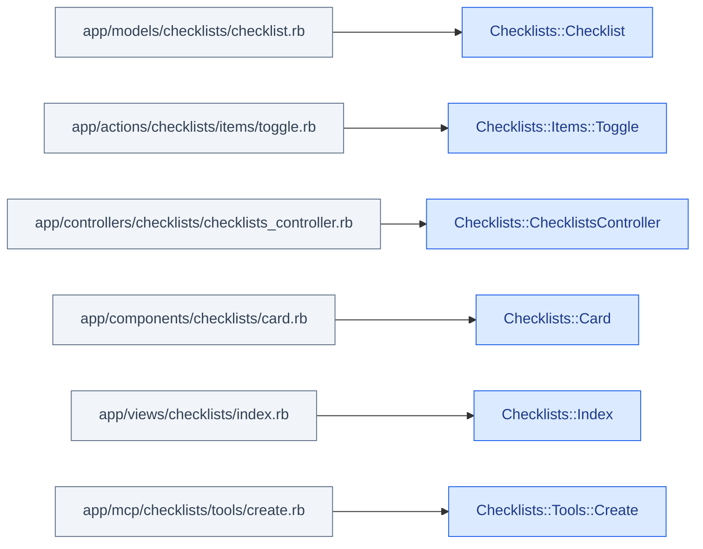
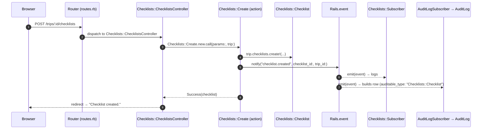
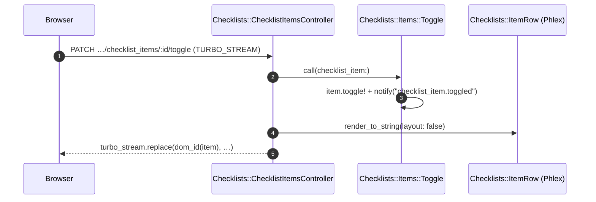
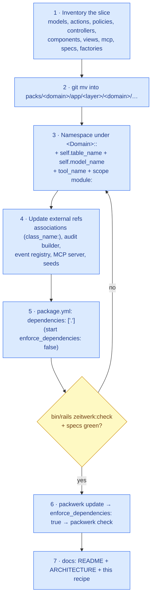

# Checklists pack — architecture & Packwerk guide

Visual walkthrough of how **Packwerk** isolates the Checklist domain, how a
request flows through the pack, and a repeatable recipe for extracting the next
component. All diagrams are [Mermaid](https://mermaid.js.org/) — they render
inline on GitHub and can be pasted into <https://excalidraw.com> via
**Insert → Mermaid to Excalidraw** for free-form editing. An editable scene is
checked in at [`designs/phase-24-checklists-pack.excalidraw`](../../designs/phase-24-checklists-pack.excalidraw).

> New here? Read [`README.md`](README.md) first for the file layout; this doc is
> the "why and how it fits together".

---

## 1. TL;DR

The Checklist domain is a **self-contained vertical slice** under one namespace
(`Checklists::`) living in `packs/checklists/`. Packwerk machine-checks that the
pack only reaches what it declares. Today it declares exactly one dependency:
the root package.



**Reading the arrow:** "Checklists *depends on* root." The reverse is **not**
declared — root still references `Checklists::*` (e.g. `Trip has_many
:checklists`) only because root keeps `enforce_dependencies: false` for now.
When more domains are extracted those root→pack references get formalised.

---

## 2. Setup — what was installed & configured



| File | Role |
|------|------|
| `Gemfile` | `packs-rails` (registers pack autoload/eager-load paths at boot); `packwerk` (the boundary checker) |
| `packwerk.yml` | global config — excludes `lib/templates/**` (ERB generator templates), enables cache |
| `package.yml` (root) | declares the root package; `enforce_dependencies: false` so root may reference packs during incremental adoption |
| `packs/checklists/package.yml` | the pack boundary: `dependencies: ['.']`, `enforce_dependencies: true` |
| `.rspec` | `--require packs/rails/rspec` so pack specs + factories are discovered |
| `config/application.rb` | registers each `packs/*/app/views` at the **root** namespace (Rails/packs-rails autoload pack *components* but not *views*) |
| `.rubocop.yml` | extends the Phlex cop exemptions to `packs/*/app/{components,views}` |
| CI / `Rakefile` | `packwerk check` runs in `project:lint` and CI; test tasks run over `spec` **and** `packs` |

---

## 3. Isolation — what Packwerk enforces

Packwerk checks every constant reference a file makes. A reference is **allowed**
only if the target lives in the same pack or in a pack listed under
`dependencies`.



- **Result today:** `bundle exec packwerk check` → **0 violations**, no
  `package_todo.yml` needed. The pack reaches only `Checklists::*` and root
  constants, and it declares root.
- **Privacy is deferred.** `enforce_privacy` (a `public/` API folder, via
  `packwerk-extensions`) is intentionally off for now — see the roadmap in
  [`prompts/Phase 24 Components Isolation.md`](../../prompts/Phase%2024%20Components%20Isolation.md).

---

## 4. Before → after: layered to pack

The domain used to be scattered across ten technical-layer directories. The
extraction gathered every layer into one namespaced slice — **no behaviour
changed**, tables and routes are identical.

```mermaid
flowchart LR
    subgraph before["BEFORE — by layer (root app/)"]
        direction TB
        b1["app/models/checklist.rb"]
        b2["app/actions/checklists/*"]
        b3["app/policies/checklist_policy.rb"]
        b4["app/controllers/checklists_controller.rb"]
        b5["app/components/checklist_card.rb"]
        b6["app/views/checklists/*"]
        b7["app/mcp/tools/*checklist*"]
        b8["spec/**/checklist*"]
    end
    subgraph after["AFTER — by domain (packs/checklists/)"]
        direction TB
        a1["app/models/checklists/{checklist,section,item}.rb"]
        a2["app/actions/checklists/… + items/…"]
        a3["app/policies/checklists/…"]
        a4["app/controllers/checklists/…"]
        a5["app/components/checklists/…"]
        a6["app/views/checklists/…"]
        a7["app/mcp/checklists/tools/…"]
        a8["spec/… (travels with the pack)"]
    end
    before ==>|"git mv + namespace under Checklists::"| after

    classDef b fill:#fee2e2,stroke:#dc2626,color:#7f1d1d;
    classDef a fill:#dcfce7,stroke:#16a34a,color:#14532d;
    class before,b1,b2,b3,b4,b5,b6,b7,b8 b
    class after,a1,a2,a3,a4,a5,a6,a7,a8 a
```



---

## 5. Constant ↔ autoload-path mapping

`packs-rails` registers each `packs/checklists/app/<layer>` as a Zeitwerk root,
so the **file path under the layer determines the constant** — all contributing
to one `Checklists::` namespace.



Three contracts are **preserved** so namespacing stays invisible to the rest of
the app:

| Concern | Technique | Effect |
|--------|-----------|--------|
| DB tables | `self.table_name = "checklists"` | no migration |
| Routes / forms | `self.model_name → "Checklist"` | `checklist`/`checklists` keys, "Create Checklist" button unchanged |
| MCP API | `tool_name "create_checklist"` | tool names stable despite `Checklists::Tools::Create` |
| Routing | `scope module: :checklists` in `routes.rb` | URLs & path helpers unchanged |

---

## 6. Flow design — a request through the pack



The same event bus powers the **live item toggle** (Turbo Stream) — note the
re-render uses the pack's own `Checklists::ItemRow` component:



**Why the event bus matters for isolation:** cross-domain reactions (audit feed,
notifications) subscribe to *string event names*, not pack constants — so the
pack stays decoupled from its consumers.

---

## 7. How-to: extract the next component



**Gotchas the Checklist extraction surfaced (apply them next time):**

1. Namespaced models change `ActiveModel::Name` → override `self.model_name`
   to keep route/param/form keys, and `self.table_name` to avoid a migration.
2. `packs-rails` autoloads pack **components** but **not views** — register
   `packs/*/app/views` at the root namespace in `config/application.rb`.
3. The `mcp` gem derives tool names from the class — pin `tool_name` to keep the
   public MCP contract.
4. `AuditLog::Builder` stores `auditable_type` from the event entity — add a
   namespaced-type override so the polymorphic type resolves.
5. After `db:reset`, **restart the app** (Puma holds the old SQLite handle).
6. Don't put `[skip ci]` in commit messages — CI is gated by `paths-ignore`.

---

## 8. Generating the dependency graph (graphwerk)

For a single pack the graph above is enough. Once several packs exist, generate
a real graph with [graphwerk](https://github.com/samuelgiles/graphwerk):

```ruby
# Gemfile (group :development, :test)
gem "graphwerk"
```
```ruby
# Rakefile
require "graphwerk/tasks" if defined?(Graphwerk)
```
```bash
# Needs the graphviz binary:
sudo apt-get install -y graphviz     # Debian/Ubuntu
bundle exec rake graphwerk:update    # writes packwerk.png
```

It was deliberately **not** kept as a dependency yet (a two-node graph isn't
worth the graphviz requirement) — re-add it when the graph earns its keep.

## 9. Editing the visuals in Excalidraw

Two ways to get an editable diagram at <https://excalidraw.com>:

1. **From Mermaid (recommended):** copy any ` ```mermaid ` block above →
   Excalidraw → **Insert → Mermaid to Excalidraw** → paste. You get fully
   editable shapes.
2. **Open the checked-in scene:** drag
   [`designs/phase-24-checklists-pack.excalidraw`](../../designs/phase-24-checklists-pack.excalidraw)
   onto the Excalidraw canvas (or **File → Open**).
